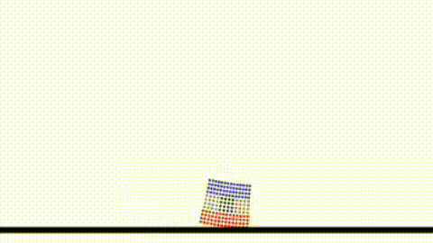
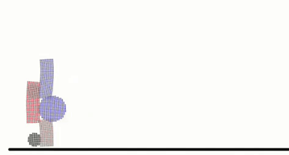

# ArtificialLife

This repository contains the progression of four lab experiments completed for ME495: Artificial Life at Northwestern University. 

## Outline

### Lab 1 (diffmpm.py)
The goal of this lab was to begin getting experience with the difftaichi environment by creating a simple customized soft body starting from the base code. I chose to make 'donut' shaped robots, with the rigid link in the center, surrounded by actuated squares to see if a rolling motion would be developed, which was successful for both the small and large donuts.

### Lab 2 (diffmpmLab2.py)
The second lab had the goal of moving beyond a fixed geometry and introducing variability into the soft body robots. I was interested in investigating a combination of circle and rectangular actuators, so my `build_robot` function incorporated both. Using a seed string, it randomly generated structures for training. The robots of this iteration were not very successful.

### Lab 3 (evo/evolutionaryAlgorithm.py)
The goal of lab 3 was to add an optimization loop. I first updated the topology of the robot, making it generate a 'spine' made of circles and then sets of legs made out of rectangles. The evolutionary loop creates a randomly initialized population then trains them. Upon completion, the top 50% are kept and randomly mutated children are created to fill in the remaining 50%. 

### Lab 4 / Final Project (evo4/evolve.py)
The last step of the project was to finalize generation of the soft body robots and their control.
The generation of the robots was altered to change the spin from circles to squares, as the legs
of the robot frequently delaminated from the body when using a spine. Additionally,
thanks to tuning of maximum mutation values, as well as the range of possible initial values,
resulted in much fewer failed individuals in the population who would not run due to memory issues
or other problems within difftaichi.

The final demo video is seen here (Click the image):

## Running Program
To run these programs, difftaichi must be installed in a Python Virtual Environment. Upon attempting to 
start the program, any additional dependencies will be indicated in error logs. Install the libraries until
it runs.

To run, make sure venv is active, then:

`/[PATH TO VENV]/bin/python3 [PATH TO SCRIPT]`